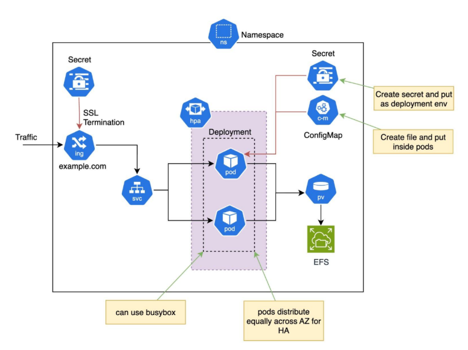

# Kubernetes Architecture on AWS EKS

## Overview

This repository contains Kubernetes manifests to deploy a scalable and highly available application architecture in AWS EKS. 
---

## Architecture Diagram

> ⚙️ **Key Components:**
- **Kubernetes Cluster**: Cluster created on AWS EKS using eksctl.
- **Namespace**: To logically separate resources.
- **Ingress (ALB)**: Handles external traffic with SSL termination using Kubernetes Secrets for SSL certificates.
- **Service**: Exposes the Deployment pods internally.
- **Deployment**: Manages application pods with auto-scaling via HPA.
- **Horizontal Pod Autoscaler (HPA)**: Automatically scales pods based on resource usage.
- **Secrets and ConfigMaps**: Injects sensitive and non-sensitive configurations into pods.
- **Persistent Volume (PV)** and **Persistent Volume Claim (PVC)**: Uses AWS EFS for scalable, shared storage.
- **Pod Distribution**: Ensures high availability by distributing pods across Availability Zones (AZs).

